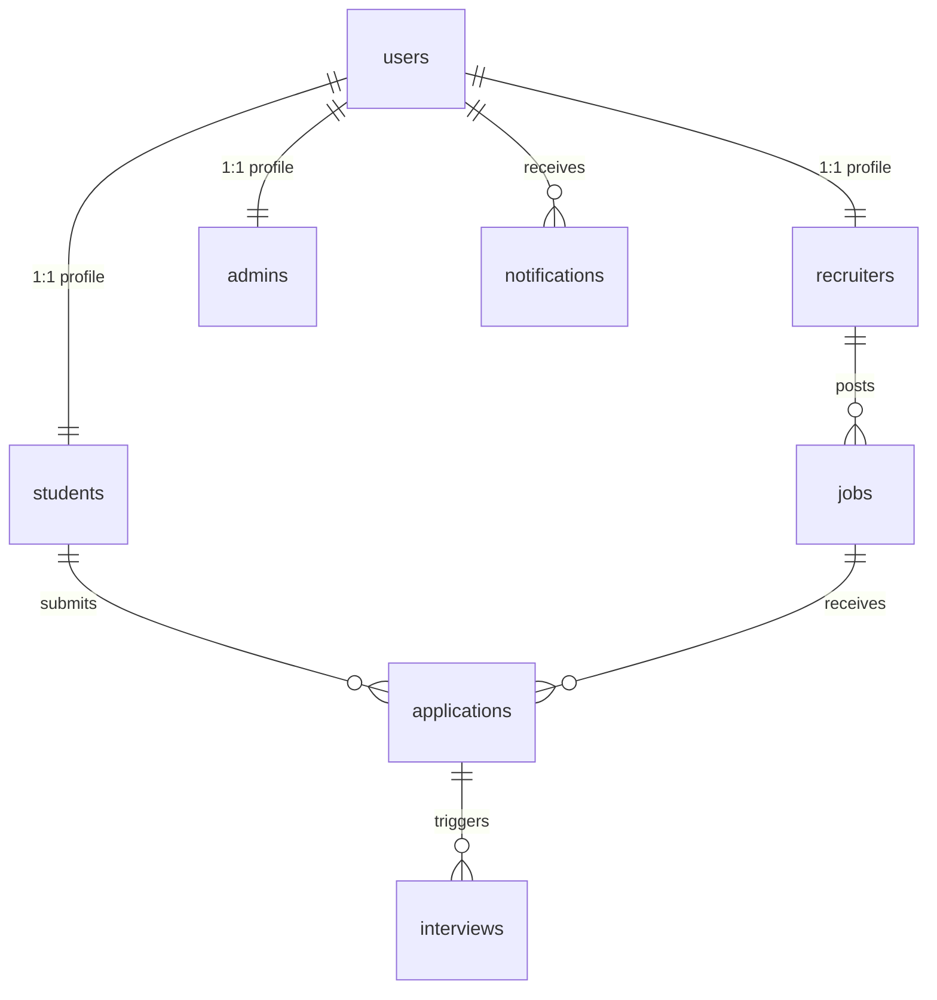

# CareerBridge AI - Intelligent Campus Placement Platform

CareerBridge AI is a production-ready, enterprise-style AI-Powered College Placement Platform. It provides students, corporate recruiters, and university administrators with an integrated portal to manage hiring, automate resume audits, predict application eligibility, match profiles to descriptions, and map learning roadmaps using Google Gemini.

---

## 📂 Project Folder Structure

The project follows a clean, decoupled monorepo structure separating the client and service layers:

```
CareerBridge AI - Intelligent Campus Placement Platform/
├── backend/
│   ├── pom.xml
│   └── src/main/
│       ├── java/com/placement/portal/
│       │   ├── PlacementPortalApplication.java
│       │   ├── config/              # Web, Security, Database configs
│       │   ├── security/            # JWT Filters, token handlers
│       │   ├── entity/              # JPA MySQL entities (User, Student, Job, etc.)
│       │   ├── document/            # MongoDB document models (Resume, AI report)
│       │   ├── repository/          # Jpa & Mongo repositories
│       │   ├── dto/                 # Request/Response payloads
│       │   ├── service/             # Business services & Gemini LLM connectors
│       │   ├── controller/          # REST API endpoints
│       │   └── exception/           # Global exception handlers
│       └── resources/
│           └── application.properties
└── frontend/
    ├── package.json
    ├── vite.config.js
    └── src/
        ├── App.jsx                  # React Router mapping
        ├── main.jsx                 # Entry point
        ├── index.css                # Global theme & glassmorphic tokens
        ├── context/                 # Auth sessions & Light/Dark themes
        ├── components/              # Shared views (Navbar, Sidebar, ProtectedRoute)
        ├── services/                # Axios configurations
        └── pages/                   # Modules (Student, Recruiter, Admin panels)
```

---

## 🗄️ Database Design

The application utilizes a hybrid database approach: **MySQL** for structured transactional records (users, applications, jobs, interviews) and **MongoDB** for unstructured resume text storage and large AI-generated JSON analysis objects.



### MySQL Tables
1. **users**: Core accounts. Password is encrypted using BCrypt.
2. **students**: Profiles, cumulative GPAs, departments, and comma-separated skills.
3. **recruiters**: Company profile, websites, and Admin verification indicators.
4. **admins**: Platform administrators.
5. **jobs**: Recruiter postings including AI cutoff CGPAs, allowed departments, and technical skills.
6. **applications**: Student job submissions tracking application status, AI match percentages, and eligibility flags.
7. **interviews**: Timetable details, virtual meetings, and status records.
8. **notifications**: Action-based user notifications.

### MongoDB Collections
1. **resumes**: Binary PDF file storage, file meta, and text extracted via Apache PDFBox.
2. **resume_analyses**: Curated ATS reports containing summaries, strengths, gaps, recommended certifications, and projects.
3. **ai_recommendations**: Individual learning paths, target roles, and certifications.

---

## 🔌 API Documentation

All REST APIs run under the `/api` servlet context path on port `8080`.

### 1. Authentication
* `POST /register`: Registers accounts. Returns registration status.
* `POST /login`: Validates user. Returns a JWT Bearer token and profile references.
* `POST /logout`: Invalidates session.

### 2. Student Module
* `GET /student/profile`: Returns the active student profile.
* `PUT /student/profile`: Updates profile fields (skills, GPA, contact).
* `POST /student/uploadResume`: Uploads a PDF resume, parses it, runs the Gemini ATS audit, and returns the audit report.
* `GET /student/resume/analysis`: Gets the latest resume ATS report.
* `GET /student/viewResume/{studentId}`: Streams the resume PDF binary inline to the browser.
* `GET /student/downloadResume/{studentId}`: Downloads the resume PDF.
* `GET /student/jobs`: Returns open positions.
* `POST /student/apply?jobId={id}`: Submits application. Triggers AI check.
* `GET /student/applications`: Returns submitted applications list.
* `DELETE /student/applications/{id}`: Withdraws application.

### 3. Recruiter Module
* `GET /recruiter/profile`: Returns recruiter details.
* `PUT /recruiter/profile`: Updates recruiter details.
* `POST /recruiter/jobs`: Publishes a new placement vacancy.
* `PUT /recruiter/jobs/{id}`: Edits a vacancy.
* `DELETE /recruiter/jobs/{id}`: Deletes a vacancy.
* `GET /recruiter/jobs`: Lists all vacancies posted by the recruiter.
* `GET /recruiter/applicants`: Lists candidate profiles who applied for the recruiter's jobs.
* `PUT /recruiter/applications/{id}/status?status={STATUS}`: Toggles application status.
* `POST /recruiter/interviews/schedule`: Schedules a candidate interview.
* `GET /recruiter/analytics`: Gets job and candidate stats.

### 4. Admin Module
* `GET /admin/dashboard`: Returns global placement metrics.
* `GET /admin/users`: Lists all users on the platform.
* `PUT /admin/user/{id}/toggle-block`: Blocks or enables an account.
* `DELETE /admin/user/{id}`: Purges a user account.
* `GET /admin/recruiters/pending`: Lists pending recruiter accounts.
* `PUT /admin/recruiter/{id}/approve`: Approves a recruiter account.
* `DELETE /admin/jobs/{id}`: Purges any job posting.

### 5. AI Features (Shared)
* `POST /ai/checkEligibility?jobId={id}`: Programmatically evaluates CGPA, department, graduation, and skill metrics.
* `POST /ai/matchResume?jobId={id}`: Matches student resume to the job description.
* `POST /ai/recommendCareer`: Triggers career advice.
* `GET /ai/recommendations`: Returns the latest career roadmap.

---

## 🛠️ Installation & Setup

### Prerequisites
* **Java**: JDK 17 or newer (JDK 25 recommended)
* **Node.js**: v20 or newer
* **MySQL**: Running local instance on port `3306`
* **MongoDB**: Running local instance on port `27017`

### Database Setup
1. Open your MySQL client and run:
   ```sql
   CREATE DATABASE placement_portal;
   ```
2. MongoDB does not require database pre-creation; it will self-initialize upon connection.

### Run Backend
1. Open a terminal inside the `/backend` directory.
2. If Maven is installed:
   ```bash
   mvn clean spring-boot:run
   ```
3. If using Maven Wrapper:
   ```bash
   ./mvnw spring-boot:run
   ```
4. The service will start at `http://localhost:8080/api`.

### Run Frontend
1. Open a terminal inside the `/frontend` directory.
2. Install packages:
   ```bash
   npm install
   ```
3. Launch development server:
   ```bash
   npm run dev
   ```
4. Open your browser to `http://localhost:5173`.

---

## 🚀 Deployment Guide

### MongoDB Atlas Configuration
Update `spring.data.mongodb.uri` in `application.properties` to connect to your cluster:
```properties
spring.data.mongodb.uri=mongodb+srv://<user>:<password>@cluster0.mongodb.net/placement_portal?retryWrites=true&w=majority
```

### Production Environment Settings
When deploying backend to Render, Railway, or AWS:
- Configure environment variables to overwrite sensitive details:
  - `SPRING_DATASOURCE_URL` = `jdbc:mysql://<prod-db-host>:3306/placement_portal`
  - `SPRING_DATASOURCE_USERNAME` = `<production-username>`
  - `SPRING_DATASOURCE_PASSWORD` = `<production-password>`
  - `SPRING_DATA_MONGODB_URI` = `<atlas-uri>`
  - `GEMINI_API_KEY` = `<production-google-gemini-api-key>`

### Frontend Deployment (Vercel)
Vercel handles React single page applications with ease. Ensure you configure a `vercel.json` file in the frontend root to handle client-side routing rewrites:
```json
{
  "rewrites": [
    { "source": "/api/(.*)", "destination": "https://<your-backend-api-url>.com/api/$1" },
    { "source": "/(.*)", "destination": "/index.html" }
  ]
}
```
